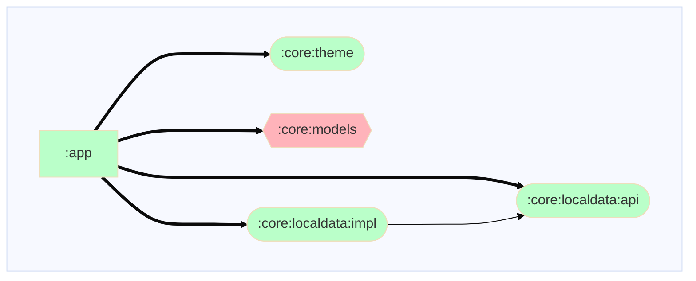

```mermaid
%%{ init: { 'theme': 'base' } }%%
graph LR;

%% Styling for module nodes by type
classDef rootNode stroke-width:4px;
classDef mppNode fill:#ffd2b3,color:#333333;
classDef andNode fill:#baffc9,color:#333333;
classDef javaNode fill:#ffb3ba,color:#333333;

%% Modules
subgraph  
  direction LR;
  :app[:app]:::andNode;
  :core:localdata:api([:core:localdata:api]):::andNode;
  :core:localdata:impl([:core:localdata:impl]):::andNode;
  :core:models{{:core:models}}:::javaNode;
  :core:theme([:core:theme]):::andNode;
end

%% Dependencies
:app===>:core:theme
:app===>:core:models
:app===>:core:localdata:api
:app===>:core:localdata:impl
:core:localdata:impl--->:core:localdata:api

%% Dependents
```