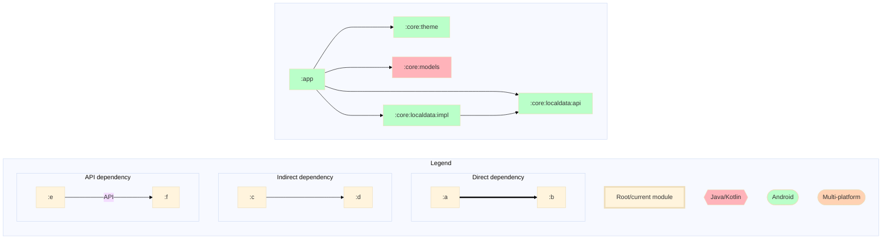

```mermaid
%%{ init: { 'theme': 'base' } }%%
graph LR;

%% Styling for module nodes by type
classDef rootNode stroke-width:4px;
classDef mppNode fill:#ffd2b3,color:#333333;
classDef andNode fill:#baffc9,color:#333333;
classDef javaNode fill:#ffb3ba,color:#333333;

%% Graph types
subgraph Legend
  direction TB;
  rootNode[Root/current module]:::rootNode;
  javaNode{{Java/Kotlin}}:::javaNode;
  andNode([Android]):::andNode;
  mppNode([Multi-platform]):::mppNode;
  subgraph Direct dependency
    direction LR;
    :a===>:b
  end
  subgraph Indirect dependency
    direction LR;
    :c--->:d
  end
  subgraph API dependency
    direction LR;
    :e--API--->:f
  end
end

%% Modules
subgraph  
  direction LR;
  :app[:app]:::andNode;
  :core:localdata:api[:core:localdata:api]:::andNode;
  :core:localdata:impl[:core:localdata:impl]:::andNode;
  :core:models[:core:models]:::javaNode;
  :core:theme[:core:theme]:::andNode;
end

%% Dependencies
:app--->:core:theme
:app--->:core:models
:app--->:core:localdata:api
:app--->:core:localdata:impl
:core:localdata:impl--->:core:localdata:api

%% Dependents
```